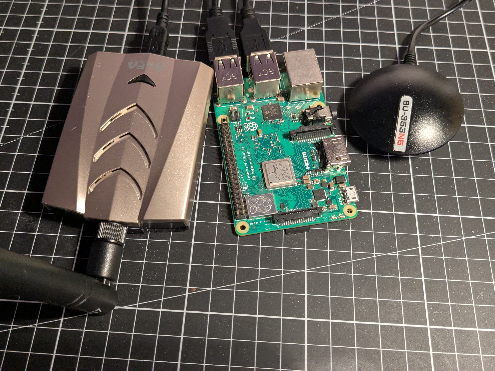

# hxcmaptool

HCX Map tool is a WiFi access point mapping utility that processes packet capture files (.pcapng)
and GPS position (.nmea) logs to estimate the geographical locations of detected WiFi access
points. It can also bind known passwords to access points using Hashcat.

*Note:*
If there is less than 3 observations for an access point, the position is estimated using a simple
weighted centroid method based on signal strength or the last known position.

## Features

- KML output for easy visualization in mapping applications like Google Earth.
- CSV output for further data analysis.
- Hashcat-found password binding to access points.
- Filter interesting access points.

## Installation

`TODO`

## Building

This tool require cargo to build, if you don't have it installed, please refer
to [the rustbook's installation guide](https://doc.rust-lang.org/cargo/getting-started/installation.html)

```bash
git clone https://github.com/UwUDev/hxcmaptool.git
cd hxcmaptool
cargo build --release
```

The binary will be located in `target/release/hxcmaptool(.exe)`.

## Usage

Usage:  hcxmaptool [options]

Options:

| short | long         | value             | description                                                               |
|-------|--------------|-------------------|---------------------------------------------------------------------------|
| -h    | --help       |                   |                                                                           |
| -d    | --directory  | WORKING DIRECTORY | Example: ./dumps                                                          |
| -f    | --filter     |                   | Filter interesting APs                                                    |
| -k    | --kml        |                   | Export the map to a KML file                                              |
|       | --kml-output | FILE PATH         | Path to output KML file                                                   |
| -c    | --csv        |                   | Export the access points to a CSV file                                    |
|       | --csv-output | FILE PATH         | Path to output CSV file                                                   |
|       | --no-hashcat |                   | Disable hashcat password binding                                          |
|       | --log-level  | LOG LEVEL         | Set the log level (off, error, warn, info, debug, trace)<br>Default: INFO |
| -V    | --version    |                   | Print version                                                             |

Example:

```bash
hcxmaptool -d ./dumps -f -k --kml-output ./output/map.kml -c --csv-output ./output/aps.csv
```

A MKL will be generated only if the `-k|--kml` flag is provided or if `--kml-output` is used.
Similarly, a CSV will be generated only if the `-c|--csv` flag is provided or if `--csv-output` is used.

## Gathering Data / Basic wardriving guide

This setup enables efficient WiFi access point mapping combined with GPS geolocation logging. It leverages [hcxdumptool](https://github.com/ZerBea/hcxdumptool) for packet capture and [gpspipe](https://gpsd.gitlab.io/gpsd/gpspipe.html) for GPS data logging.

### Personal Hardware
My basic ~100$ setup includes:
- **Wi-Fi Adapter:** ALFA Network AWUS036ACHM (monitor mode & injection support)
- **GPS Receiver:** GlobalSat BU-353N5
- **Host System:** A second hand Raspberry Pi 3B+ running Raspbian 64-bit OS
- **Optional:** Smartphone as a Wi-Fi hotspot, with Tailscale VPN for remote access



### Setup Procedure
1. **Configure GPS:**
    - Set the baud rate (usually 9600, but 4800 for the BU-353N5)
    - Assign the correct serial port (e.g., `/dev/ttyUSB0`) in `gpsd` and start `gpspipe`.

2. **Prepare Wi-Fi:**
    - Connect your Wi-Fi adapter
    - Ensure it supports monitor mode and packet injection

3. **Start Logging:**
```bash
#!/bin/bash

mkdir -p $HOME/dumps
TIMESTAMP=$(date +%Y%m%d-%H%M)

# Start GPS logging
gpspipe -r > "$HOME/dumps/${TIMESTAMP}.nmea" &
GPSPIPE_PID=$!
echo "GPS logging started (PID: $GPSPIPE_PID)"

# Start Wi-Fi capture with hcxdumptool
sudo hcxdumptool -i wlan1 \
  -w "$HOME/dumps/${TIMESTAMP}.pcapng" \
  --bpf=$HOME/blacklist.bpf \
  -c 1a,6a,11a,2a,1a,6a,11a,13a,1a,6a,11a,3a,1a,6a,11a,12a,1a,6a,11a,4a,1a,6a,11a,10a,1a,6a,11a,5a,1a,6a,11a,9a,1a,6a,11a,7a,1a,6a,11a,8a \
  --rds=1

# Stop GPS
echo "Stopping GPS logging..."
kill $GPSPIPE_PID

echo "Files saved:"
echo "  WiFi: $HOME/dumps/${TIMESTAMP}.pcapng"
echo "  GPS:  $HOME/dumps/${TIMESTAMP}.nmea"
```

### Remote Access
- Use your phone as a hotspot for SSH
- Add a bpf filter to exclude your phone's MAC address so you don't capture your own traffic and don't desync you AP.
- Run Tailscale to create a VPN tunnel, ensuring reliable remote connectivity on the move
- Launch processes inside `screen` or similar to keep them alive if your connection drops

Tailscale is optional on some smartphones but must of them hide hotspot devices from the local network in both directions.